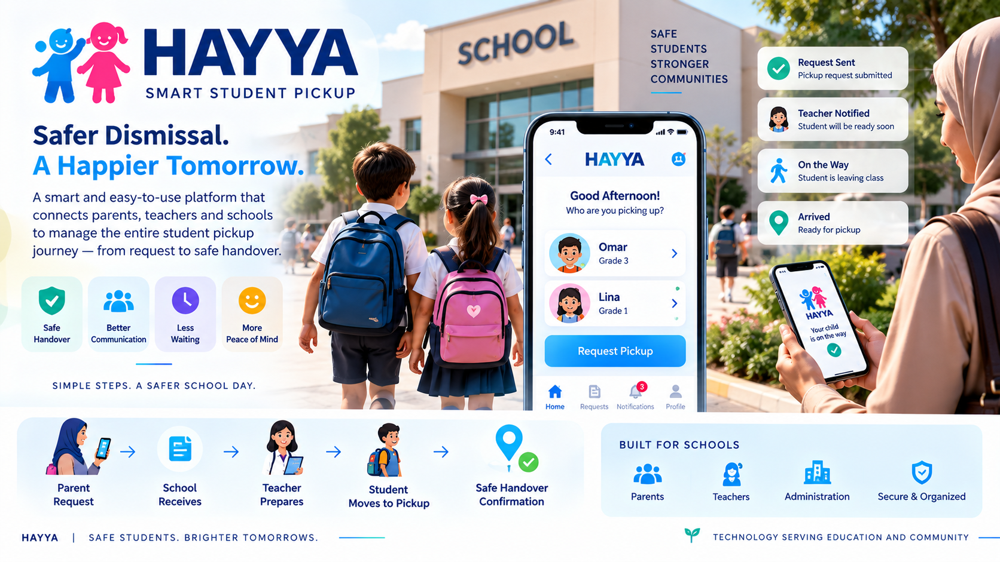

<p align="center">
  
</p>

# هَيّا | HAYYA


### Technology Snapshot

**Node.js • Web Application • SQLite • API-Oriented Architecture • PostgreSQL-Ready**

**Focus:** Student Pickup • School Dismissal • Workflow Automation • Safe Handover
## Smart & Secure Student Pickup Management

> **From “I’m here” to safe handover — one coordinated school dismissal workflow.**

HAYYA is a digital student-pickup platform designed to connect **guardians, teachers, pickup teams and school administration** during one of the busiest and most sensitive parts of the school day: dismissal.

The platform replaces fragmented calls, paper lists and verbal coordination with a clear digital journey:

**Guardian Arrival → Child Selection → Teacher Notification → Preparation → Pickup Area → Confirmed Handover**

---

# The Challenge

School dismissal looks simple from the outside, but operationally it involves several people and several important questions:

- Has the guardian actually arrived?
- Which child or children are being requested?
- Which classroom should receive the request?
- How long will the child need before reaching the pickup area?
- Has the student left the classroom?
- Has the child reached the pickup point?
- Was the handover completed?
- Can administration see what is happening across the school?

HAYYA turns these interactions into a structured workflow with visible states.

---

# Core Capabilities

## 1. Guardian Pickup Experience

A guardian can initiate a pickup request and select the relevant child or children associated with the family profile.

The experience is designed around minimal interaction:

**Arrived → Select Child → Request Pickup**

A guardian with multiple children can manage them from one family context while each child remains an independent pickup action.

This is important when siblings are in different classes or become ready at different times.

---

## 2. Per-Child Pickup Workflow

HAYYA does not treat a family pickup as one indivisible request.

Each selected student can move independently through the pickup journey.

This enables:

- Different classrooms
- Different teachers
- Different readiness times
- Individual status tracking
- Individual handover confirmation

while keeping the children connected to the same guardian context.

---

## 3. Teacher Workflow

Teachers receive pickup requests for students under their responsibility.

The teacher can:

- See the requested student
- Acknowledge the pickup request
- Set an estimated preparation / arrival time
- Progress the student from the classroom toward pickup

This gives the pickup area and guardian better visibility without repeatedly contacting the classroom.

---

## 4. Teacher-Controlled ETA

The remaining time is determined by the teacher who understands the classroom situation.

Instead of presenting an artificial automated estimate, HAYYA allows the responsible teacher to communicate a practical ETA.

This supports situations where a child may need additional time because of:

- Packing belongings
- Classroom activity
- Distance to pickup
- Temporary delay

The workflow can therefore communicate readiness more realistically.

---

## 5. Pickup Area Operations

The pickup team has a dedicated workflow for students moving toward handover.

The pickup area can:

- See incoming students
- Track their status
- Confirm arrival
- Complete the handover

This separates classroom preparation from the final pickup operation while keeping both synchronized.

---

## 6. Confirmed Handover

The student journey does not end when the classroom receives a request.

HAYYA follows the process through to the pickup area and records completion of the handover workflow.

Conceptually:

**Requested → Preparing → Moving → Arrived → Handed Over**

This gives administration a clearer operational trail than informal verbal coordination.

---

# 7. Kiosk Pickup

Not every guardian should be forced to use a personal mobile workflow.

HAYYA therefore includes a **school kiosk** experience.

A guardian can use a family identifier at the kiosk to locate the family context, select the required student(s), and initiate the same pickup workflow.

This provides an alternative access channel while keeping requests inside the same operational system.

---

# 8. Family-Centered Student Management

A guardian profile can be associated with multiple students.

The design supports:

- One guardian / family context
- Multiple children
- Individual student selection
- Per-child request state

This reduces repeated data entry and makes sibling pickup easier to manage.

---

# 9. Administration Dashboard

School administration receives an operational view of the dismissal process.

The admin experience includes:

- Daily indicators
- Pickup activity
- Operational status
- Activity / operations log

This helps management understand what is happening during dismissal without interrupting teachers or pickup staff.

---

# 10. Operational Activity Log

Important pickup actions can be recorded in an operational log.

This creates a timeline of system activity that can help with:

- Operational follow-up
- Process visibility
- Reviewing completed pickup activity
- Understanding the sequence of handoff events

---

# Role-Based Experience

### Guardian
Request pickup and select one or more children.

### Teacher
Receive the request, prepare the student and communicate ETA.

### Pickup Team
Track incoming students and confirm final handover.

### Kiosk
Provide an alternative guardian access point.

### Administration
Monitor the overall dismissal operation and activity history.

---

# Student Pickup Journey

```text
              Guardian Arrives
                     │
                     ▼
             Select Child(ren)
                     │
                     ▼
              Pickup Request
                     │
          ┌──────────┴──────────┐
          ▼                     ▼
     Child / Class A       Child / Class B
          │                     │
          ▼                     ▼
       Teacher A             Teacher B
          │                     │
        ETA A                 ETA B
          │                     │
          └──────────┬──────────┘
                     ▼
               Pickup Area
                     │
                     ▼
             Arrival Confirmed
                     │
                     ▼
               Safe Handover
```

---

# Why HAYYA?

HAYYA is designed around coordination rather than adding technology for its own sake.

The platform aims to create:

### Clearer Communication
The request moves digitally between the people responsible for each stage.

### Less Waiting Uncertainty
Teacher-provided ETA gives the pickup process better visibility.

### Better Operational Flow
Classrooms and pickup teams work through shared states.

### Family Convenience
Multiple children can be managed from one guardian context.

### Administrative Visibility
School management gains a real-time operational perspective and activity history.

---

# Data & System Architecture

The current platform uses a lightweight architecture suitable for MVP validation while keeping the database layer isolated for future expansion.

### Current Foundation
- Web-based application
- Node.js runtime
- SQLite database
- API-oriented workflow
- Role-specific screens

### Scalability Direction
The data-access architecture is designed so the persistence layer can later move toward PostgreSQL while preserving the workflow and APIs as much as possible.

---

# Workflow Architecture

```text
┌────────────┐
│  Guardian  │──────┐
└────────────┘      │
                    ▼
┌────────────┐  ┌───────────────────┐
│   Kiosk    │─▶│  Pickup Workflow  │
└────────────┘  └─────────┬─────────┘
                          │
                          ▼
                  ┌───────────────┐
                  │    Teacher    │
                  │ Preparation + │
                  │      ETA      │
                  └───────┬───────┘
                          │
                          ▼
                  ┌───────────────┐
                  │  Pickup Area  │
                  │   Handover    │
                  └───────┬───────┘
                          │
                          ▼
                  ┌───────────────┐
                  │     Admin     │
                  │ Visibility &  │
                  │ Activity Log  │
                  └───────────────┘
```

---

# Product Vision

HAYYA is not simply a notification app.

It is designed as a **student-dismissal coordination platform** where each participant sees the information and actions relevant to their role.

The long-term product concept is centered on:

**Identity → Authorization → Arrival → Classroom Coordination → Student Movement → Handover → Operational Record**

The current showcase focuses only on capabilities represented by the implemented MVP and avoids presenting future concepts as completed functionality.

---

# Portfolio & Privacy Notice

This repository is a **sanitized public product showcase**.

It intentionally excludes:

- Real student names
- Guardian identities
- Family codes
- School records
- Contact information
- Production credentials
- Private access information
- Production source code
- Internal infrastructure configuration

Any people, names or identifiers shown in promotional material should be treated as fictional examples rather than real school records.

---

# هَيّا | HAYYA

**Smart Student Pickup • School Dismissal • Workflow Coordination • Safe Handover**

### Safer Dismissal. Clearer Coordination. Better School Experience.
